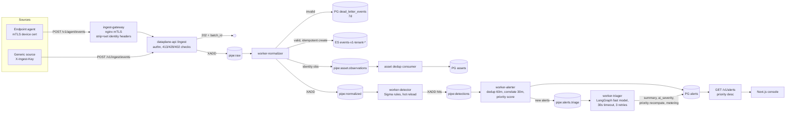
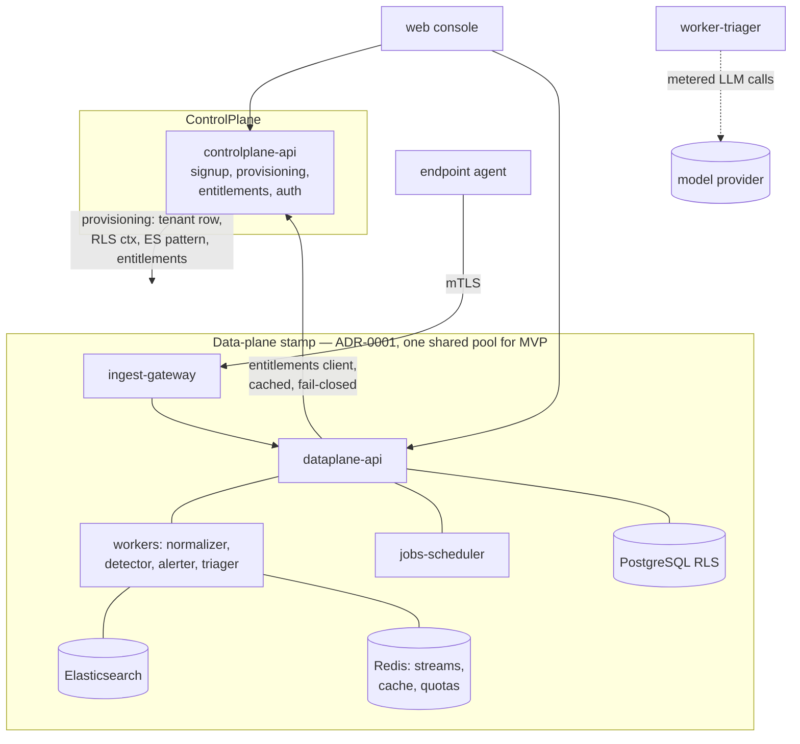

# Technical Design: Platform Foundation MVP

- **Feature slug:** `platform-foundation-mvp`
- **Status:** Draft v1.1 — 2026-07-08 — amended per initial threat model (B-2, B-3, G-1, SEC-39/40)
- **Author:** solution-architect agent
- **Inputs:** `docs/prd/platform-foundation-mvp.md`, `docs/prd/business-model.md`, ADR-0001, ADR-0002, `docs/security/threat-model-platform-foundation-mvp.md` (SEC-1..50 are binding implementation requirements)
- **Companion contracts:** `docs/contracts/event-schema.md`, `docs/contracts/api-contracts.md`, `docs/contracts/priority-score.md`
- **ADRs:** ADR-0003 (monorepo/modular monolith), ADR-0004 (Redis Streams), ADR-0005 (entitlements fail-closed), ADR-0006 (device identity) — all Accepted as amended

---

## 1. Monorepo Layout (binding for all implementation agents)

```
/
├── services/
│   ├── controlplane/            # FastAPI app #1 (see §2)
│   │   └── app/
│   │       ├── signup/          # E1: signup, verification, provisioning saga
│   │       ├── entitlements/    # E2: plan config, entitlements API, trial lifecycle
│   │       ├── identityadmin/   # users, roles, sessions, login (AC-77/78)
│   │       └── main.py
│   ├── dataplane/               # FastAPI app #2 + workers (see §2)
│   │   └── app/
│   │       ├── ingest/          # E4 API: agent batch + generic ingest, quotas
│   │       ├── enrollment/      # E8 server side: tokens, enroll, heartbeat, revoke
│   │       ├── assets/          # E3: inventory, dedup, merge/split, billable count
│   │       ├── alerts/          # E6 API: queue, state machine, correlation reads
│   │       ├── rules/           # E5 API: rule list, per-tenant toggle
│   │       ├── investigation/   # E7: deep-investigation stub + quota
│   │       ├── audit/           # E10: audit write API + query
│   │       ├── workers/         # normalizer, detector, alerter, triager (§4)
│   │       ├── jobs/            # scheduled: retention, trial freeze/purge, billable window, agent-offline
│   │       └── main.py
│   └── README.md                # boundary rules (import-linter config lives at repo root)
├── agent/                       # endpoint agent (own toolchain/release train per ADR-0002;
│   │                            # language choice = endpoint-agent ADR, not this doc)
│   ├── collector-core/          # provider abstraction (AC-62)
│   ├── providers/etw/           # Windows ETW provider
│   ├── providers/simulated/     # cross-platform simulated provider (CI/demo, AC-64)
│   └── packaging/               # MSI/EXE, silent install (OQ-10, endpoint-agent owns)
├── web/                         # Next.js console (E9)
├── packages/                    # shared Python libs, versioned together with services
│   ├── schemas/                 # pydantic models generated FROM docs/contracts (single source)
│   ├── pipeline/                # transport abstraction over Redis Streams (ADR-0004; SEC-20)
│   ├── tenancy/                 # tenant-context middleware, RLS session GUC helpers (SEC-23/24)
│   ├── entitlements-client/     # cached client per ADR-0005 (SEC-39)
│   ├── audit/                   # append-only audit writer (SEC-42..45)
│   └── telemetry/               # OTel setup, structured logging, per-stage metrics (AC-91)
├── rules/                       # managed Sigma-style rule pack (detection-engineering owns)
│   ├── pack.yaml                # pack manifest: version, rule list
│   └── rules/*.yml
├── infra/
│   ├── compose/                 # docker-compose.yml for local MVP (§7)
│   ├── helm/                    # stamp chart (cloud-platform owns; AC-90)
│   └── terraform/
└── docs/                        # prd, adr, design, contracts, security, ceo
```

Boundary rules (CI-enforced via import-linter):
- `services/controlplane` and `services/dataplane` never import each other. Cross-plane calls go over HTTP (internal API) only, authenticated per §5.1 (SEC-40).
- Both may import `packages/*`. `packages/*` never import `services/*`.
- `web/` and `agent/` consume only the HTTP contracts in `docs/contracts/`.

## 2. Service Decomposition

Per ADR-0003: **two modular FastAPI applications** (one per plane, per ADR-0001) plus data-plane worker processes, all in the monorepo. Not microservices-per-capability for MVP: docker-compose must run the whole platform locally, and module boundaries + separate processes give us the seams to extract services later without rewiring contracts.

| Component | Plane | Process | Owner agent | Responsibilities | Stores |
|---|---|---|---|---|---|
| controlplane-api | Control | `uvicorn services.controlplane` | backend-architect | Signup, email verification, provisioning saga (AC-1..8), plan config, entitlements API (AC-12..18), trial freeze state, `abuse_frozen` flag, users/roles/sessions (AC-77/78) | PG (control schema), Redis (sessions, entitlement cache source) |
| dataplane-api | Data | `uvicorn services.dataplane` | backend-architect | Ingest APIs, enrollment/heartbeat, assets, alerts, rules toggle, investigation stub, audit query, usage | PG (tenant schema, RLS), ES (event reads), Redis (quotas, streams producer) |
| worker-normalizer | Data | `python -m ...workers.normalizer` | backend-architect | Raw → normalized schema, validation, DLQ (AC-31/32), asset upsert signal, ES write (AC-33/34) | ES, PG (DLQ), Redis Streams |
| worker-detector | Data | `python -m ...workers.detector` | detection-engineering | Sigma-style evaluation, rule pack hot reload, rule-error taxonomy per B-2/SEC-28 (AC-35..40) | Redis Streams, PG (rule state) |
| worker-alerter | Data | `python -m ...workers.alerter` | backend-architect | Alert create/dedup/correlate (AC-41..43), priority compute (contract), enqueue triage | PG (alerts), Redis Streams |
| worker-triager | Data | `python -m ...workers.triager` | ai-platform | LangGraph fast-model triage, retries/timeouts (AC-48..52; SEC-32..38), cost metering, priority recompute (incl. B-4 clamp) | PG (triage, metering), Redis Streams |
| jobs-scheduler | Data | `python -m ...jobs` (cron-style loop) | backend-architect | Retention purge (AC-16), trial freeze/purge (AC-9/10; SEC-46), billable 30-day window (AC-26), agent-offline marker (AC-61), DLQ 7-day cleanup | PG, ES |
| ingest-gateway | Data edge | nginx | cloud-platform | TLS termination; **mTLS client-cert verification** for agent routes (ADR-0006); **unconditional identity-header stripping on every route + authenticated hop to dataplane-api (B-3/SEC-14, mechanism in §5)** | — |
| web | — | Next.js | frontend-architect | Minimal SOC console (E9; SEC-31/50 hardening) | — |
| agent | — | native | endpoint-agent | Enrollment, providers, buffering, delivery (E8) | local disk buffer |

Tenancy-mode agnosticism (AC-82): tenant context enters exclusively via `packages/tenancy` middleware (session → tenant, ingest key → tenant, device cert → tenant) and is set as the Postgres GUC `app.tenant_id` per request/consumer message (`SET LOCAL`, per SEC-23 / threat model §4.1). No module reads deployment shape.

## 3. Data Stores

| Store | Used for | Isolation |
|---|---|---|
| PostgreSQL | Control: accounts, tenants (incl. `status` + `abuse_frozen` flag), plans, entitlements, users, sessions meta. Data: assets + identity links, **devices (source of truth for the SEC-10 allowlist)**, alerts + events-link table, alert audit trail, rules state, enrollment tokens, ingest keys, DLQ, metering, audit log, correction pins (AC-25) | RLS pattern per threat model §4.1 (FORCE RLS, `SET LOCAL app.tenant_id`, deny-by-default on unset GUC — SEC-23) on every tenant-scoped table; control-plane tables in separate schema; runtime role ≠ owner, no BYPASSRLS (AC-79) |
| Elasticsearch | Normalized events (hot). Index `events-v1-{tenant_id}-{yyyy.MM}`, alias `events-{tenant_id}` | Per-tenant index pattern via the single tenant-scoped query helper (SEC-24); all queries fail closed without a valid tenant UUID (AC-80). Retention job deletes expired monthly indices (AC-16) |
| Redis | Streams (pipeline, ADR-0004), entitlements cache (ADR-0005), ingest rate counters (sliding window), deep-investigation daily quota (atomic Lua DECR, AC-55), sessions, **device/ingest-key status cache (allowlist per B-1/SEC-10/17)**, tenant-status cache (`abuse_frozen`), onboarding-step signals (AC-70) | Key prefixes carry `tenant_id` (threat model §4.3); hardened per SEC-19 (ACLs, no FLUSH*/CONFIG for app user, AOF everysec, internal network only) |
| Secrets store | DB/Redis/LLM/internal-service credentials, CA key reference (SEC-9/49) | compose: git-ignored `.env` from template; stamp: K8s Secrets + KMS |

Idempotent ingest (AC-34): ES document `_id` = `sha256(tenant_id + ":" + source_scope + ":" + source_event_id)` where `source_scope` = `device_id` (agent) or `ingest_key_id` (generic); write with `op_type=create`; duplicate → counted, dropped.

## 4. Pipeline (Redis Streams, ADR-0004)

Streams (all `MAXLEN ~ 1_000_000`, consumer groups, at-least-once, XAUTOCLAIM for stuck messages; every message carries `tenant_id` — set only by the authenticated producer per SEC-20 — and `trace_id`):

| Stream | Producer | Consumer group | Payload |
|---|---|---|---|
| `pipe:raw` | ingest API (after auth, size, quota, trial/abuse checks) | `normalizers` | batch ref: raw JSON + source ctx |
| `pipe:normalized` | normalizer (after ES write succeeds) | `detectors` | normalized event (envelope + class) |
| `pipe:detections` | detector | `alerters` | detection hit (rule id/version/severity, ATT&CK, event refs) |
| `pipe:alerts.triage` | alerter (new alerts only) | `triagers` | alert id + assembled single-tenant context |
| `pipe:asset.observations` | normalizer + enrollment | `asset-dedup` | identity observation for dedup (AC-20/22) |
| DLQ | normalizer | — | malformed events → PG table `dead_letter_events` (per-tenant via RLS, 7-day retention, parse error stored, 64KB cap per SEC-21) per AC-32 |

Failure semantics (AC-91): every event ends stored (ES), dead-lettered (PG), or rejected with an error code at the API; each stage emits OTel metrics labeled `{tenant_id, stage, outcome}`. Residual-loss window (AOF everysec + MAXLEN) documented and alerted per SEC-22/G-4.

### 4.1 Data-flow diagram



### 4.2 Container/context diagram



### 4.3 Ingest → alert sequence (SLO path, AC-30/33/37/48)

```mermaid
sequenceDiagram
    participant A as Agent
    participant G as Gateway (mTLS)
    participant I as Ingest API
    participant R as Redis Streams
    participant N as Normalizer
    participant E as Elasticsearch
    participant D as Detector
    participant L as Alerter
    participant T as Triager (LLM)
    A->>G: POST /v1/agent/events (batch ≤1000/≤5MB)
    G->>I: strip identity headers, set from verified cert, + gateway auth
    I->>I: device allowlisted? trial live? abuse_frozen? quota ok? size ok?
    I->>R: XADD pipe:raw
    I-->>A: 202 {batch_id} (p95 ≤ 300ms)
    R->>N: consume
    N->>E: bulk create (idempotent _id)  — queryable ≤30s p95
    N->>R: XADD pipe:normalized
    R->>D: consume → rule matches
    D->>R: XADD pipe:detections
    R->>L: consume → dedup/correlate → alert row (≤60s p95 e2e)
    L->>R: XADD pipe:alerts.triage (new only)
    R->>T: consume → LLM (30s timeout, 3 retries)
    T->>L: triage fields + priority recompute (≤120s p95; never blocks alert)
```

## 5. Key mechanism notes (implementation-ready)

| Concern | Design |
|---|---|
| Provisioning saga (AC-3/5) | Idempotent step machine in controlplane: tenant row → RLS context → ES index template + first index → entitlements (Trial) → admin user → trial_expires_at. Each step retried with same idempotency key; terminal failure ⇒ `provisioning_failed`, ops alert, tenant unreachable (no session issuable). |
| Trial freeze (AC-9) | `tenant.status ∈ {active, frozen, purged, provisioning, provisioning_failed}`; ingest checks status via entitlements client (cached ≤5 min); frozen ⇒ 402 `TRIAL_EXPIRED`; console: write endpoints reject 403 `TENANT_FROZEN`, reads allowed. |
| **Abuse freeze (G-1/SEC-39)** | Tenant model carries a distinct boolean **`tenant.abuse_frozen`** (orthogonal to `status` — any tenant, trial or paid, can be abuse-frozen). Set/cleared only via an internal operator API (audited). Checked on the SEC-10 allowlist pattern (PG source of truth, Redis tenant-status cache, deny-on-unknown), **never via the entitlements LKG cache**, so cut-off is ≤60s. Effect: ingest and all console writes ⇒ 403 `TENANT_FROZEN`; enrollment rejected; reads remain (evidence preservation). Explicitly on ADR-0005's never-graced exclusion list. |
| **Gateway identity hop (B-3/SEC-14)** | Concrete mechanism: (1) nginx **unconditionally clears `X-Device-Id`, `X-Device-Tenant`, `X-Client-Cert-*` and all reserved identity headers on EVERY route** (agent, generic, console, error paths) via `proxy_set_header <h> ""`, then sets them only from the verified client cert on agent routes; (2) the gateway→dataplane hop is authenticated: compose-internal network / K8s NetworkPolicy restricting dataplane-api ingress to the gateway **plus** a per-deployment 256-bit secret header `X-Gateway-Auth` (from the secrets store, rotatable) injected by nginx on every proxied request; (3) dataplane-api middleware **fails closed**: agent routes without a valid `X-Gateway-Auth` ⇒ 401, identity headers on requests lacking gateway auth are discarded; (4) ALL external traffic (agent, generic ingest, console→dataplane) enters via the gateway so stripping is universal. QA negative tests: identity-header injection from outside ⇒ 401 (SEC-14). |
| **Device/ingest-key authorization (B-1/SEC-10/17)** | **Allowlist, fail-closed** — never a revocation blocklist. Every agent-route request resolves `X-Device-Id` → device-status record: Redis `device:{tenant_id}:{device_id}` = `{status, cert_serial}` cached from PG `devices` (source of truth); Redis miss ⇒ PG read + backfill; revoked/absent ⇒ 401 `DEVICE_REVOKED`/`DEVICE_IDENTITY_INVALID`; **both stores down ⇒ 503 `SERVICE_UNAVAILABLE` (deny)**; presented cert serial must match current (or ≤24h renewal-overlap) serial. Same pattern for ingest keys (`ingestkey:{tenant_id}:{key_id}`, SEC-17). See ADR-0006 §3. |
| Ingest quota (AC-86/87) | Redis sliding-window (60s, 10 buckets) per tenant checked before XADD; over ⇒ 429 + `Retry-After` (never 202-then-drop). Per-tenant fairness in workers: consumer batches interleave by tenant to protect noisy-neighbor SLO. |
| Alert dedup key (AC-41/42) | `(tenant_id, rule_id, entity_key)`, `entity_key = hostname\|user` (rule declares which entity fields apply; default host+user). Window 60 min plan-config; open alert = state `new` or `acknowledged`. |
| Correlation (AC-43) | On alert create: find open alerts same tenant+host with `last_seen` within 30 min (plan-config), different rule ⇒ join/create `correlation_group_id`. |
| Rule pack hot reload + **rule-error taxonomy (B-2/SEC-28)** | `rules/pack.yaml` published to PG `rule_pack` tables by an authenticated, audited content-publish operation (SEC-27; no code deploy); detector polls pack version every 30s; per-tenant toggle overlays global pack (AC-38). **Rule errors (amends AC-40's blanket auto-disable):** (a) load/compile-time errors ⇒ rule disabled at publish + ops alert (content problem, safe); (b) **runtime per-event evaluation exceptions ⇒ caught per event, `rule_eval_errors` metric incremented, event skipped for that rule, rule STAYS enabled** — attacker-crafted events must never disable detection (threat model §2.5); (c) runtime auto-disable only when a rule fails on a sustained fraction of events across MULTIPLE tenants (plan-config threshold) + ops review alert. AC-40's intent (one bad rule never stops detection) is preserved: all other rules always continue. Regex eval uses a linear-time engine or per-match timeout (SEC-29). |
| Asset dedup (AC-22..25) | Deterministic matcher in `asset-dedup` consumer, order: agent `device_id` → (lower(hostname), os_family) → MAC. Applied rule stored on asset. Manual merge/split writes a **pin** (identifier → asset binding) consulted before automatic rules, preventing re-merge (AC-25). Billable = deduped assets with `last_seen ≥ now-30d` and not revoked (AC-26/27). |
| Deep-investigation quota (AC-53..55) | Redis Lua: `if remaining>0 then DECR; return ok` on key `quota:di:{tenant}:{yyyymmdd}` seeded from entitlements; atomic ⇒ no oversubscription; metering row per run; reset 00:00 UTC. |
| Audit (AC-83..85) | `packages/audit` writer → PG `audit_log`: INSERT-only `audit_writer` role, no UPDATE/DELETE for any runtime role, guard trigger, DB-clock timestamps, same-transaction writes, no secret material or raw payloads (SEC-42..45); 365-day retention independent of event retention; survives trial purge (SEC-48). |
| Auth (AC-77/78) | Email+password (argon2id per SEC-1), breached-password check at signup, Redis-backed HttpOnly session cookies (new session ID at login, CSRF token per SEC-3), 24h idle + 7d absolute timeout, invalidate on password/role change, 10-failure lockout/backoff + per-IP throttle (SEC-4). Roles `admin`/`analyst` enforced server-side with **deny-by-default route declarations** (SEC-30). MFA-ready: user model carries `mfa_enrolled` fields unused in MVP. |
| LLM tenancy (AC-52) | Triage context assembled per message from a single tenant's data only; prompt builder takes `tenant_id`-scoped fetchers; no batch mixing across tenants (SEC-36). Prompt structure, output constraints, zero-tool graph, provider controls, budget backstop per SEC-32..38; scoring clamp per B-4 in `docs/contracts/priority-score.md`. |

### 5.1 Internal service authentication (SEC-40 decision)

Two internal hops, two mechanisms — both layered on network restriction (compose internal networks; K8s NetworkPolicies in the stamp):

1. **gateway → dataplane-api:** static per-deployment 256-bit secret header `X-Gateway-Auth` (secrets store, rotatable by redeploying gateway+dataplane with the new value; two-value overlap accepted during rotation). Chosen over internal mTLS here because nginx already terminates the *external* mTLS and a header check keeps the compose path trivial; dataplane fails closed without it (B-3 item 3).
2. **controlplane ↔ dataplane (`/internal/v1/...`):** **HMAC-signed short-lived service tokens** — `Authorization: Bearer v1.<service_name>.<expires_unix>.<hmac_sha256>`, key per service-pair from the secrets store, token lifetime ≤300s, ±30s clock skew, verified server-side with constant-time compare. Chosen over inter-plane mTLS for MVP because it needs no additional PKI/cert distribution in compose and is trivially replaced by mesh mTLS in dedicated stamps (upgrade path, no contract change). `PUT /internal/v1/tenants/{id}/plan` additionally requires an operator identity claim recorded in the audit entry — no anonymous plan changes (SEC-40).
3. Internal routes are mounted on a separate router never exposed via the gateway/public listeners (SEC-30/40).

security-architect reviews this pick at final review per SEC-40.

## 6. SLO → design mapping

| SLO | Mechanism |
|---|---|
| Signup→console ≤60s p95 (AC-3) | Saga steps are metadata-only (no infra provisioning in shared pool) |
| Ingest 202 ≤300ms p95 (AC-30) | Auth/size/quota checks (Redis-cached allowlists) + single XADD only; all parsing async |
| Event queryable ≤30s p95 (AC-33) | ES refresh 5s; normalizer bulk writes |
| Ingest→alert ≤60s p95 (AC-37) | Stream consumers with small batches; detector in-memory compiled rules |
| Triage ≤120s p95 (AC-48) | Dedicated triage stream; alert visible immediately regardless (AC-50) |
| Alerts API ≤500ms @10k (AC-44) | PG alerts table, composite indexes `(tenant_id, state, priority desc)`, cursor pagination |

## 7. Local MVP runtime (docker-compose, `infra/compose/`)

Services: `postgres:16`, `elasticsearch:8.x (single node)`, `redis:7` (hardened per SEC-19), `controlplane-api`, `dataplane-api`, `worker-normalizer`, `worker-detector`, `worker-alerter`, `worker-triager`, `jobs`, `ingest-gateway` (nginx w/ mTLS + header-strip config per SEC-14/15; dev CA generated by a bootstrap script — non-production per SEC-9), `web`, `mailpit` (dev email), optional `agent-sim` (simulated provider container for AC-64 e2e). Secrets via git-ignored `.env` from a template (SEC-49). No Kafka, no object storage in MVP (warm tier deferred; retention purge deletes from hot — flagged to product). Same images deploy via Helm for the stamp (AC-90).

## 8. Deferred / explicitly not designed here

- Response execution, connectors, kernel sensor, SSO, billing/payments (PRD out-of-scope).
- ES warm/cold tier (business-model consequence #2): MVP purges at hot-retention expiry; age-to-object-storage is a fast-follow design.
- Dedicated-stamp provisioning automation: layout and tenancy middleware keep services shape-agnostic (AC-82); automation is design-only per PRD.
- Rule-pack content signing (SEC-27 fast-follow, devsecops); WORM audit export (post-MVP per SEC-42); CA rotation runbook before GA (G-2, cloud-platform).
